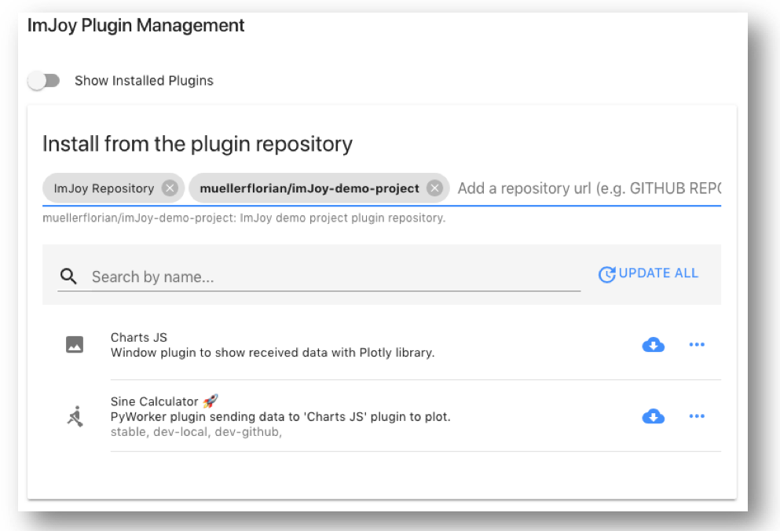
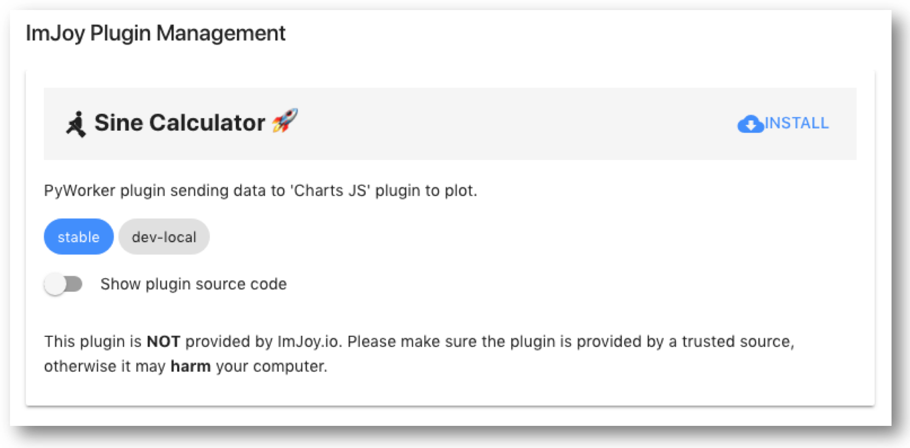

# Distribution

The recommended way to distribute ImJoy plugins is with a specific url.


## Creating a ImJoy plugin repository
Lastly, we can add a configuration file to our GitHub repository that allows
to distribute ImJoy plugins with simple urls, and facilitates to define dependencies
among plugins.

To use this script, you have to install node.js first. In an Anaconda terminal type
```bash
conda install -c conda-forge nodejs
```

Once you installed the node.js, open an Anaconda terminal in the root folder of
the repository and type
```bash
node update_manifest.js
```

This will run the script, which will generate a new file `manifest.imjoy.json`.
In this file you have to only change the name that you want to give to your plugin
repository (usually the same name as the GitHub repository). Note that you only have
to do this the first time you create this file for a given repository. Subsequent
updates will not change the name.

!!! note "<a href="https://github.com/muellerflorian/ImJoy-demo-project/blob/master/manifest.imjoy.json#L2" target="_blank"> **manifest.imjoy.json**</a>"
    "name": "ImJoy-demo-project"

Now ImJoy recognises the GitHub repository as a plugin repository, and you can directly open
with with this link:

<a href="https://imjoy.io/#/app?r=muellerflorian/imJoy-demo-project" target="_blank"> **https://imjoy.io/#/app?r=muellerflorian/imJoy-demo-project**</a>


</img>

This uses

*  the base url `https://imjoy.io/#/app?`
*  and the identifier or the repository  `r=muellerflorian/imJoy-demo-project`,
    where `r` indicates that a repo should be opened, `muellerflorian` specifies
    the GitHub account, and `imJoy-demo-project` the name of the plugin repository.


## Specifying a plugin dependency
We have to two plugins, the main  plugin `Sine Calculator.imjoy.html` to perform calculations,
and the helper plugin `Charts JS.imjoy.html` to display the data.

We can now specify this helper plugin as a dependency for the stable release in the
main plugin. The helper plugin will then be automatically installed.

!!! note "<a href="https://github.com/muellerflorian/ImJoy-demo-project/blob/master/imjoy-plugins/Sine%20Calculator.imjoy.html#L25" target="_blank"> **Sine Calculator.imjoy.html**</a>"
    ```json
    "dependencies": { "stable": ["muellerflorian/imJoy-demo-project:Charts JS"]}
    ```

## Specifying the plugin url for the stable release

You can also specify an url that allows to directly install the plugin:

<a href="https://imjoy.io/#/app?p=muellerflorian/imJoy-demo-project:Sine Calculator@stable&w=imjoy-demo-project" target="_blank"> **https://imjoy.io/#/app?p=muellerflorian/imJoy-demo-project:Sine Calculator@stable&w=imjoy-demo-project**</a>

This will open ImJoy with the install dialog for the specified plugin:

</img>

In this dialog you can inspect the source code and also select the tag (`stable` or `dev-local`).

Please note two parameters in the above url
`@stable`: indicates the tag of the plugin that should be used.
`w=imjoy-demo-project`: indicates the ImJoy workspace in which the plugin should be installed.

For more informations on how to construct such plugins urls, see
<a href="https://imjoy.io/docs/#/development?id=generating-a-plugin-url" target="_blank"> **here**</a>
