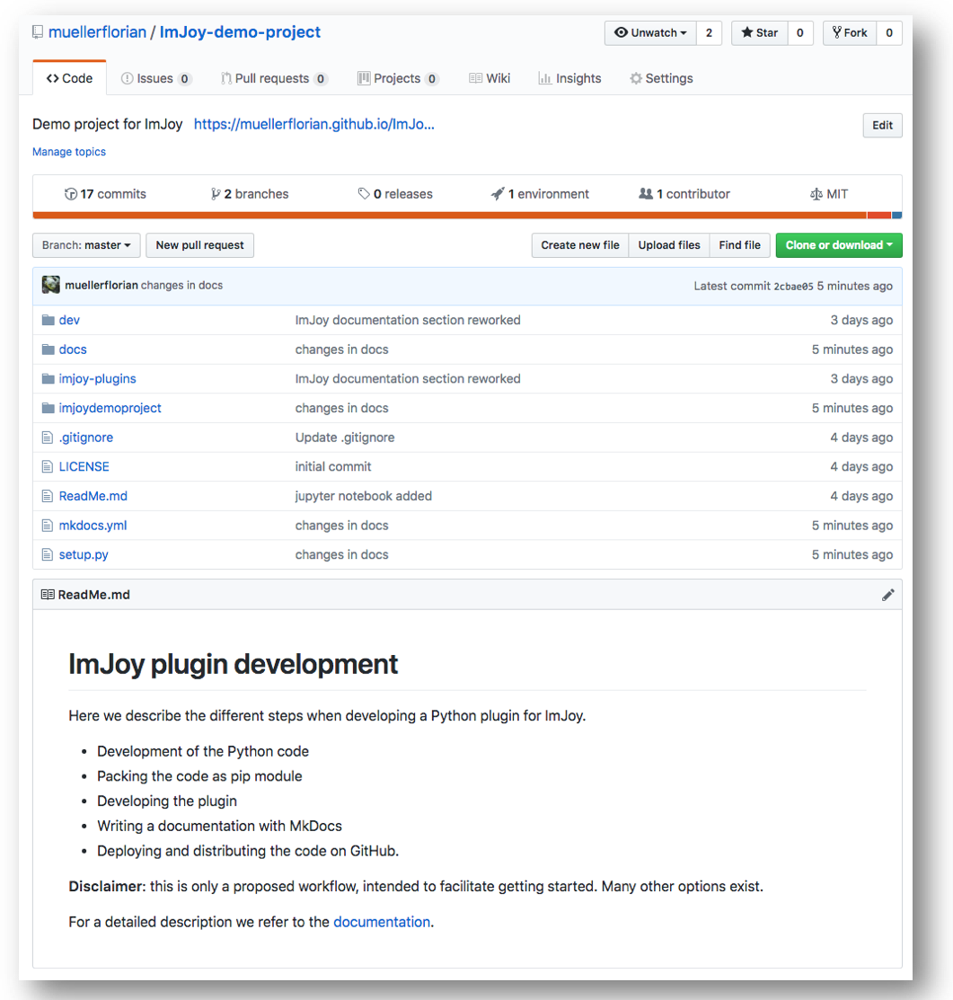

# Deployment on GitHub
It is good practice to deploy your code on GitHub. This provides

1. Secure **backup**,
2. **version control**. This is important to either backtrack changes, or provide
  a specific version of your code to a collaborator

GitHub repositories can be either publish or private. So even closed developments are possible.

If you don't have an account, create one and follow the provided instructions for how to create
a repository. Several excellent resources exist explaining how to use GitHub, such as this [one](https://guides.github.com/activities/hello-world/).

Below is a screen shot of this repository:

!!! note "<a href="https://github.com/muellerflorian/ImJoy-demo-project" target="_blank"> ImJoy-demo-project</a>"
    </img>
