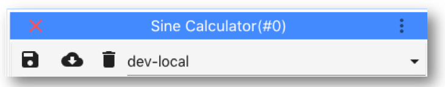

# ImJoy plugin development

To launch ImJoy, simply open a browser and open <a href="https://imjoy.io" target="_blank"> **https://imjoy.io**</a>.

You can then either check of some of the ImJoy plugins, or start working on your plugin.

## Native Python plugin
You can add a plugin template with the `+ PLUGINS` button.
For this simple tutorial, we create a **`native python`** plugin.

However, this plugin type requires the plugin engine. Yo can find a dedicate section
in the ImJoy user manual for how to install the engine
<a href="https://imjoy.io/docs/#/user_manual?id=imjoy-app-and-plugin-engine" target="_blank"> **here**</a>.


Once you have the engine running and connected to ImJoy, you can save and execute
your plugins. The first step is to fill out some fields of the `<config>` block. To get started,
we name the plugin `Sine Calculator` (field `name`) and give a short description (`description`).

!!! note "<a href="https://github.com/muellerflorian/ImJoy-demo-project/blob/master/imjoy-plugins/Sine%20Calculator.imjoy.html#L12" target="_blank"> **Sine Calculator.imjoy.html**</a>"
    ```json
      <config lang="json">
      {
      "name": "Sine Calculator",
      "type": "native-python",
      "version": "0.1.0",
      "api_version": "0.1.2",
      "description": "PyWorker plugin sending data to 'Charts JS' plugin to plot.",
      ...
      }
      </config>
    ```

We can then save the plugin from its toolbar. Once save the plugin will show up with its
name in the plugin interface, and have a little rocket 🚀 next to its name. This indicates
that the plugin is powered by the plugin engine. Pressing on its name will run it,
for the template plugin it will simply show `Hello world` in the plugin engine.


## Tag facilitate development
A very useful features are `tags` to change how a plugin is executed. Here we use
tags to differentiate between a development and stable release version. For this,
we add the following definition to the <config> block where we have three different
tags:

!!! note "<a href="https://github.com/muellerflorian/ImJoy-demo-project/blob/master/imjoy-plugins/Sine%20Calculator.imjoy.html#L17" target="_blank"> **Sine Calculator.imjoy.html**</a>"
    ```json
    "tags": ["stable","dev-local","dev-github"]
    ```

When you save your plugin, these tags will show up in the bar of the code editor.
For the next steps, select `dev-local`. Please note, that when you will distribute
your plugins, you can specify which tag should used. More about this in the dedicated
section about distribution.

</img>


**More information** on tags can be found
<a href="https://imjoy.io/docs/#/development?id=tags" target="_blank"> **here**</a>.

## Using own module

During development, we will use our locally stored module.
This can be done in the `<script>` block. Here we have to add the
absolute path of the module `PathToModule` to the Python system path.
Please note the `importlib.reload` allows to reload the library if you have changes.


!!! note "<a href="https://github.com/muellerflorian/ImJoy-demo-project/blob/master/imjoy-plugins/Sine%20Calculator.imjoy.html#L31" target="_blank"> **Sine Calculator.imjoy.html**</a>"
      ```python
      <script lang="python">

      if 'dev-local' == api.TAG:
          import importlib
          import sys

          sys.path.insert(0, 'PathToModule')
          import outils
          importlib.reload(outils)
      </script>
      ```


We can then use this module in our Python code.

!!! note "<a href="https://github.com/muellerflorian/ImJoy-demo-project/blob/master/imjoy-plugins/Sine%20Calculator.imjoy.html#L52" target="_blank"> **Sine Calculator.imjoy.html**</a>"
      ```python
      import asyncio

      class ImJoyPlugin():

          # Run upon plugin execution
          async def run(self, my):
             x,y = outils.calc_sine(10)
             print(f'x values: {x}')
             print(f'y values: {y}')
      ```

When running the plugin, the calculated vectors will be shown in the Python plugin engine.

**Note 1**: that the engine does not support any graphics. We will show you how
to plot the data further down.

**Note 2**:  `import asyncio` and `async def` are used to permit asynchronous
function calls. For more details see
<a href="https://imjoy.io/docs/#/api?id=asynchronous-programming" target="_blank"> **here**</a>.

## Create plugin user interface
For our example, the user has to specify how many data-points should be calculated.
The easiest way to obtain user input is by using the plugin user interface.
This can be done with the `ui` string the the `<config` block.

!!! note "<a href="https://github.com/muellerflorian/ImJoy-demo-project/blob/master/imjoy-plugins/Sine%20Calculator.imjoy.html#L18" target="_blank"> **Sine Calculator.imjoy.html**</a>"
    ```json
    "ui": ["# of data points : {id:'n_points', type: 'number', min: 0, placeholder:20}"]
    ```

After saving the plugin, it has now a little menu that you can show by pressing
on the arrow down symbol next to its name.

</img>

Each parameter that you specify in such an interface, can be retrieved by its
unique `id` from the object `my`, e.g. `my.config.n_points` for our example. To now
perform the calculations with the user specified number of points, simply use


!!! note "<a href="https://github.com/muellerflorian/ImJoy-demo-project/blob/master/imjoy-plugins/Sine%20Calculator.imjoy.html#L55" target="_blank"> **Sine Calculator.imjoy.html**</a>"
      ```python
      x,y = outils.calc_sine(my.config.n_points)
      ```

**Further information**

*   For more infos on the `ui` string, see
    <a href="https://imjoy.io/docs/#/development?id=ui" target="_blank"> **here**</a>.
*   For more advanced interfaces, you can use a `window` plugin that allows you
    to design an interface with HTML. We more information we refer to a dedicated
    <a href="https://imjoy.io/docs/#/demos?id=user-interface-calling-python-worker" target="_blank"> **demo**</a>.


## Showing results in ImJoy
This plugin is executed in the plugin engine, where we used `print` to show
some results. However, we would like to show plots and more detailed feedback
directly in the ImJoy app. For this, ImJoy provides a number of dedicated
<a href="https://imjoy.io/docs/#/api?id=api-functions" target="_blank"> **API functions**</a>.

### ImJoy log

For example, we could replace the `print` statements with the api function `api.log`.

!!! note "<a href="https://github.com/muellerflorian/ImJoy-demo-project/blob/master/imjoy-plugins/Sine%20Calculator.imjoy.html#L59" target="_blank"> **Sine Calculator.imjoy.html**</a>"
      ```python
      api.log(f'y values: {y}')
      api.log(f'y values: {y}')
      ```

This then shows the results in the plugin specific log, which can be opened by
clicking on the grey inverted exclamation mark next to the plugin name. Note that
this log can be cleared and exported.

</img>

### Plot results
The undoubtedly best way to show these data is with a plot.

In order to do this, we require a second plugin, this time a `window` plugin,
which will display data it receives. We use HTML to determine how the plugin
looks like, and JavaScript how the window plugin show process received data.
An excellent introduction to HTML, JavaScript with hands-on example is
<a href="https://www.w3schools.com" target="_blank"> **w3schools.com**</a>

We create a template window plugin, and name it `Charts JS`. You can find the
<a href="https://github.com/muellerflorian/ImJoy-demo-project/blob/master/imjoy-plugins/Charts%20JS.imjoy.html" target="_blank"> **full  file here**</a>,
and we will reference specific sections throughout the explanations here.

This plugin is only useful when called from another plugin, which can be specified
in the `<config>` block. Such a **"helper" plugin** will show up in the plugin window, but
it will be greyed out and can't be run by clicking on its name.

!!! note "<a href="https://github.com/muellerflorian/ImJoy-demo-project/blob/master/imjoy-plugins/Charts%20JS.imjoy.html#L20" target="_blank"> **Charts JS.imjoy.html**</a>"
      ```json
      "runnable": false
      ```


Many JavaScript libraries permit interactive plotting of data. Here, we used
<a href="https://plot.ly/javascript/" target="_blank"> **Plotly.js**</a>
, a very rich library for interactive
data visualisation. To use this library, you have to specify
it in the requirements

!!! note "<a href="https://github.com/muellerflorian/ImJoy-demo-project/blob/master/imjoy-plugins/Charts%20JS.imjoy.html#L21" target="_blank"> **Charts JS.imjoy.html**</a>"
      ```json
      "requirements": ["https://cdn.plot.ly/plotly-latest.min.js"]
      ```

**Ploty show its plots** in so called HTML division `<div>`. We can add such a
division to the`<window>` block of the plugin, and give it the id `chart`.

!!! note "<a href="https://github.com/muellerflorian/ImJoy-demo-project/blob/master/imjoy-plugins/Charts%20JS.imjoy.html#L56" target="_blank"> **Charts JS.imjoy.html**</a>"
      ```html
      <window lang="html">
          <div>
              <div id="chart"></div>
          </div>
      </window>
      ```

Then we have to tell the plugin how to **display data it received**. If an ImJoy plugin
is called by another plugin, it can receive data in the `my.data` object in its run function.
In this run function, we the simply create the variables that are needed by Plotly
to show data. We determine:
1.  Where we should plot: the `<div>` element named `chart`
0.  What and how we should plot: the `x`, and `y` data, the plot type and the
marker size. In the actual Plotly call we

!!! note "<a href="https://github.com/muellerflorian/ImJoy-demo-project/blob/master/imjoy-plugins/Charts%20JS.imjoy.html#L40" target="_blank"> **Charts JS.imjoy.html**</a>"
    ```javascript
    // Call plotly
    var myPlot = document.getElementById('chart'),
        data = [ {  x:my.data.x,
                    y:my.data.y,
                    type:'scatter',
                    mode:'lines+markers',
                    marker:{size:5} } ],
        layout = { };

    Plotly.newPlot('chart', data, layout,{responsive: true});
    ```

The last step is then you call this new plugin from within our native Python plugin.
This can be done with the api function `api.createWindow`. We create first a
dictionary containing the data we would like to send to the window plugin. This contains
also other required fields to create a new window (including its type)


!!! note "<a href="https://github.com/muellerflorian/ImJoy-demo-project/blob/master/imjoy-plugins/Sine%20Calculator.imjoy.html#L66" target="_blank"> **Sine Calculator.imjoy.html**</a>"
      ```python
      data_plot = {   'name':'Plot charts - with JavaScript',
                      'type':'Charts JS',
                      'w':12, 'h':10,
                      'data':{
                          'x': x.tolist(),
                          'y': y.tolist()
                      }
                  }
      await api.createWindow(data_plot)
      ```

* `name`: is the title of the window that will be created
* `type`: this is the name of the window plugin, we would like to call, e.g. `Charts JS` in our example
* `w`, `h`: window width, and height
* `data`: containing the actual `x` and `y` values. Please note that numpy arrays
          are not supported and have to be converted to lists.

When you run the plugin, it will show a window with the calculated curve.

</img>

**Further information**

*   For more infos on `api.createWindow` string, see
    <a href="https://imjoy.io/docs/#/api?id=apicreatewindow" target="_blank"> **here**</a>.
*  For a more detailed information about how to plot data in JavaScript and how to
   refresh the window we refer this
   <a href="https://imjoy.io/docs/#/demos?id=python-plugin-displaying-a-chart" target="_blank"> **demo**</a>.


## Exporting the plugin
You can then download the plugin code from the editor. This will download a file
name with the name of the plugin, followed by a unique string, and the extension `.imjoy.html`.

We saved the two plugins it without the unique string in the folder
<a href="https://github.com/muellerflorian/ImJoy-demo-project/tree/master/imjoy-plugins" target="_blank"> **`imjoy-plugin`**</a>:

* `Sine Calculator.imjoy.html`: to perform calculations.
* `Charts JS.imjoy.html`: to display the data.
