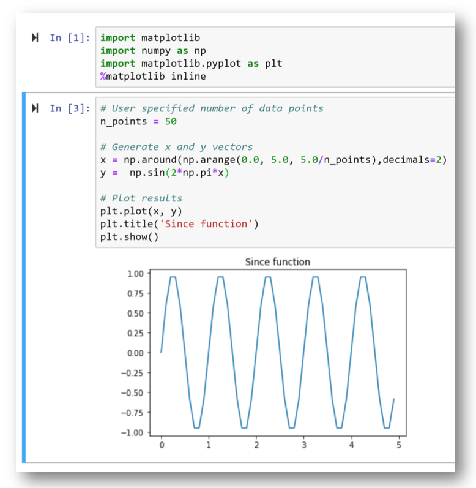

# Python code development

Here we only provide a brief overview of how Python code could be developed. We use
these explanation to establish the necessary terminology for the following steps
in this tutorial.

Many dedicated resources exist on the web for each of these aspects,
and we invite the reader to consult these for more detailed information.

## Development environment
The actual Python code performing the calculation can be implemented, tested,
and continued to be used outside of ImJoy.

A simple way to get started in Python is using
<a href="https://www.anaconda.com/distribution/" target="_blank"> **Anaconda**</a>.
This open source distribution comes with many Python packages pre-installed.
Further it already contains the development environments **Spyder** and **Jupyter Notebook**.

Here, we use Anaconda (Python 3.6) and **Jupyter Notebook**.
In such a notebook, you can implement and test your Python code.
To store these notebooks, we create a subfolder `dev` in the project folder `ImJoy-demo-project`.

!!! note "<a href="https://github.com/muellerflorian/ImJoy-demo-project/blob/master/dev/dev-calc-sine.ipynb" target="_blank"> **dev-calc-sine.ipynb**</a>"
    </img>

## Package code as Python module
Once your code is working, you can package it as a module.

Python modules are `.py` files that consist of Python code. They can contain
definitions of functions, classes, and variables that can then be used in
other Python programs.

### Wrap code in functions
One thing to keep in mind, is that typically the input of these functions is
generated in your actual ImJoy plugin. For instance, we will ask the user to
specify the number of data-points that should be calculated.

### Make module
We will wrap the above code in a function as shown below. This function is then
saved in a `.py` file (`outils.py` in the subfolder `imjoydemoproject`).

!!! note "<a href="https://github.com/muellerflorian/ImJoy-demo-project/blob/master/imjoydemoproject/outils.py#19" target="_blank"> **outils.py**</a>"
    ```python
    # Define a function
    def calc_sine(n_points=10):
        x = np.around(np.arange(0.0, 5.0, 5.0/n_points),decimals=2)
        y = np.sin(2*np.pi*x)
        return x, y
    ```

It is good practice to comment your  code, e.g. following the guidelines of
<a href="https://github.com/google/styleguide/blob/gh-pages/pyguide.md#38-comments-and-docstrings" target="_blank"> **Google*</a>

In order to be able to import this module, we have to **update the Python sys path**.
Assuming the we open the Jupyter notebook, we can do this with a
relative path, but an absolute path will work as well.

!!! note "<a href="https://github.com/muellerflorian/ImJoy-demo-project/blob/master/dev/dev-calc-sine.ipynb" target="_blank"> **dev-calc-sine.ipynb**</a>"
    ```python
    # Update system path
    import sys
    sys.path.insert(0, '../imjoydemoproject')

    # Import outils module
    import outils

    # Call function
    outils.calc_sine(50)
    ```
